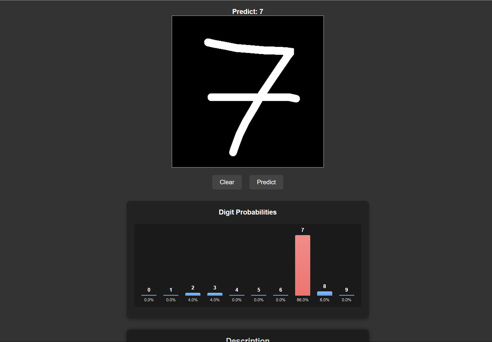

# Digit Recognition in C

This is a digit recognition demo project written in pure C, powered by my
custom neural network library
**[neuralib](https://github.com/JordenHuang/nerualib)**.

It includes a multithreaded HTTP server and a web-based frontend that allows
users to draw a digit and get real-time predictions.

> **Note**: The server currently only runs on **Unix-like systems**
> (Linux/macOS).



## Feature
- A neural network implemented in C and trained on the MNIST dataset

- A backend HTTP server (in C) with multithreaded request handling that
  handles inference via `POST` requests

- A simple HTML/JS frontend for users to draw digits and get predictions

- Displays predicted digit and a bar chart of class probabilities

## Usage

### Run server

Compile the server code, run the server, and open the link to draw digits.

```bash
make && ./server.out
```

### Train a model

Modify train.c if needed, then build and run.

```bash
make train && ./train.out
```

## Project structure

- `assets/`: Assets for README file
- `html/`: Frontend html files
- `models/`: Serialized model weights and structure
- `thirdparty/`: External libraries or dependencies
- `tools/`: Tool for processing MNIST data (e.g. squash them into a single file (.bin file))
- `unused/`: Legacy or experimental code kept for reference
- `CREDIT`: Acknowledgements for third-party code
- `Makefile`: I use `make` as my tool for building the project
- `README.md`: This file
- `neuralib.h`: My C neural network framework
- `server.c`: The HTTP server that handles inference
- `train.c`: Code to train the model

## Roadmap

1. Load training data and labels
2. Build the model
3. Train the model
4. Evaluate the model
5. Use the model to predict images

6. Build a web client for drawing digits
7. Build a web server to recieve the image and return the predict result

## TODOs

- [x] Need better preprocess to make our own written digit more like MNIST
- [x] How come the bin file that large?
- [x] Create predict.c
- [x] Validate, accuration util

